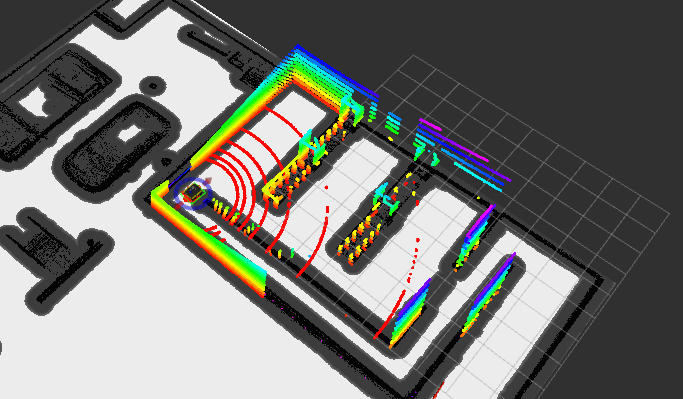
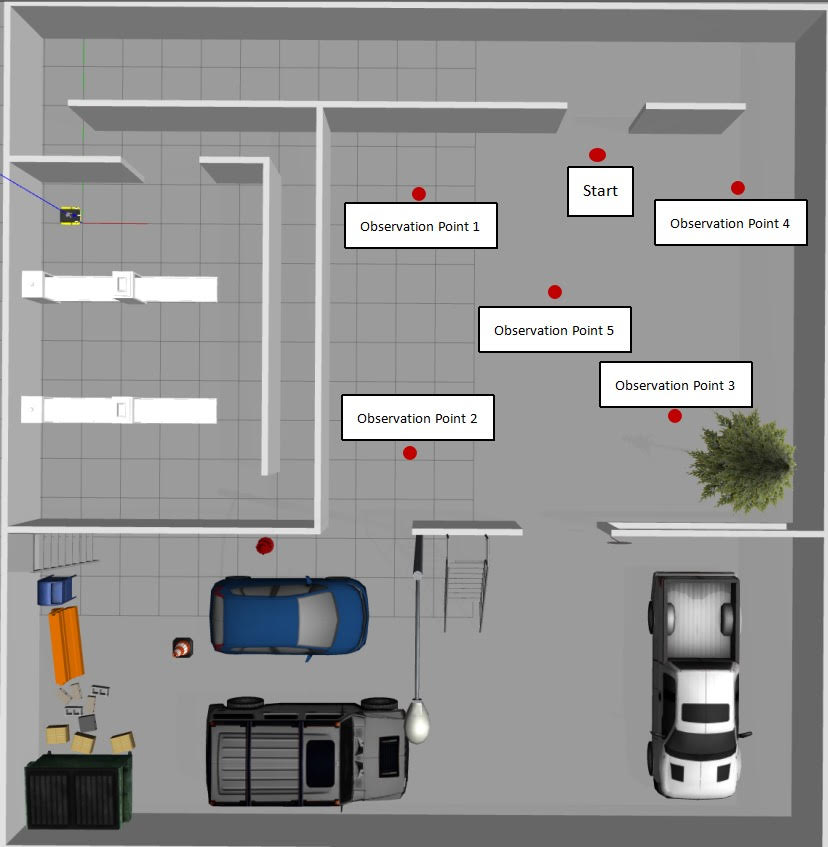
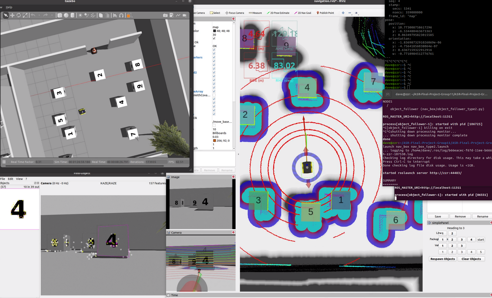

# ME5413_Final_Project

NUS ME5413 Autonomous Mobile Robotics Final Project
> origin Authors: [Christina](https://github.com/ldaowen), [Yuhang](https://github.com/yuhang1008), [Dongen](https://github.com/nuslde), and [Shuo](https://github.com/SS47816)

> Project group 11：[Ma RuiQi](https://github.com/RachelFengRobotics)，[ChenHan](https://github.com/Hans1011)，[Bai ChengXi](https://github.com/roudanshuangfi)，[LiuFu YuLiang](https://github.com/YuliangLF)，[Zhong ZeRen](https://github.com/HardyPavel)，[Zhang ZiRui](https://github.com/daverui)


<!-- > Our Video -->

You can quickly understand the final outcomes of our project by watching this video demonstration：

[](https://www.youtube.com/watch?v=TTfZJp_KL5U)

## Dependencies

* System Requirements:
  * Ubuntu 20.04 (18.04 not yet tested)
  * ROS Noetic (Melodic not yet tested)
  * C++11 and above
  * CMake: 3.0.2 and above
* This repo depends on the following standard ROS pkgs:
  * `roscpp`
  * `rospy`
  * `rviz`
  * `std_msgs`
  * `nav_msgs`
  * `geometry_msgs`
  * `visualization_msgs`
  * `tf2`
  * `tf2_ros`
  * `tf2_geometry_msgs`
  * `pluginlib`
  * `map_server`
  * `gazebo_ros`
  * `jsk_rviz_plugins`
  * `jackal_gazebo`
  * `jackal_navigation`
  * `velodyne_simulator`
  * `teleop_twist_keyboard`
  * `teb planner`->`sudo apt-get install ros-noetic-teb-local-planner`
  * `rviz-plugin`->`sudo apt-get install ros-noetic-rviz-imu-plugin`
  * `find_object_2d`->`sudo apt-get install ros-noetic-find-object-2d`
  * And this [gazebo_model](https://github.com/osrf/gazebo_models) repositiory

## Installation

This repo is a ros workspace, containing three rospkgs:

* `interactive_tools` are customized tools to interact with gazebo and your robot
* `jackal_description` contains the modified jackal robot model descriptions
* `me5413_world` the main pkg containing the gazebo world, and the launch files

**Note:** If you are working on this project, it is encouraged to fork this repository and work on your own fork!

After forking this repo to your own github:

```bash
# Clone your own fork of this repo (assuming home here `~/`)
cd
git clone https://github.com/RachelFengRobotics/ME5413_Final_Project_Group11.git
cd ME5413_Final_Project

# Install All Dependencies Required by the Original Project
rosdep install --from-paths src --ignore-src -r -y

# Install Some Additional Dependencies We Provided

#teb planner
sudo apt-get install ros-noetic-teb-local-planner
#rviz-plugin
sudo apt-get install ros-noetic-rviz-imu-plugin
#find_object_2d
sudo apt-get install ros-noetic-find-object-2d

# Build
catkin_make
# Source 
source devel/setup.bash
```

To properly load the gazebo world, you will need to have the necessary model files in the `~/.gazebo/models/` directory.

There are two sources of models needed:

* [Gazebo official models](https://github.com/osrf/gazebo_models)
  
  ```bash
  # Create the destination directory
  cd
  mkdir -p .gazebo/models
  
  # Clone the official gazebo models repo (assuming home here `~/`)
  git clone https://github.com/osrf/gazebo_models.git
  
  # Copy the models into the `~/.gazebo/models` directory
  cp -r ~/gazebo_models/* ~/.gazebo/models
  ```

* [Our customized models](https://github.com/NUS-Advanced-Robotics-Centre/ME5413_Final_Project/tree/main/src/me5413_world/models)

  ```bash
  # Copy the customized models into the `~/.gazebo/models` directory
  cp -r ~/ME5413_Final_Project/src/me5413_world/models/* ~/.gazebo/models
  ```

# Project Introduction

In this project, we used a Jackal car to achieve the basic functions of mapping and navigation in a mini factory. At the same time, we initially implemented the functions of exploration, target recognition, and tracking in the randomly generated box area of the factory. Specifically, our main work is as follows:

I. Mapping

(1) Using 2D LiDAR algorithm to construct a map of the mini factory, the algorithms used in this project include:`Cartographer`,`GMapping`.

(2) Using 3D LiDAR algorithm to build a map of the mini factory, the algorithms used in this project include:`ALOAM`,`FLOAM`,`LEGO-LOAM`,`FAST-LIO`.

(3) Compare the performance of various mapping algorithms to generate the final`. pgm` map for navigation planning.

II. Navigation

(1) We used `AMCL` method to enable robots to achieve self localization，after that we use `A*` as the global planning algorithm on the constructed map and tested the performance of `DWA` and `TEB` as local planners respectively.

(2) A navigation algorithm for randomly generated boxes was designed, and visual functionality was introduced using the `find_object_2D` ros package to achieve automatic exploration, target recognition, and navigation of the car in the target area.


# Running the Project

## Part I Mapping

This command will launch the gazebo with the project world

```bash
# Launch Gazebo World together with our robot
roslaunch me5413_world world.launch
```
If you wish to explore the gazebo world a bit, we provide you a way to manually control the robot around:

```bash
# Only launch the robot keyboard teleop control
roslaunch me5413_world manual.launch
```

**Note:** This robot keyboard teleop control is also included in all other launch files, so you don't need to launch this when you do mapping or navigation.


After finishing mapping, run the following command in the thrid terminal to save the map:

```bash
# Save the map as `my_map` in the `maps/` folder
roscd me5413_world/maps/
rosrun map_server map_saver -f my_map map:=/map
```

If you want to execute more mapping algorithms, you can use our pre recorded Ros bag and execute the following command in the directory of the mapping algorithm file we provide（Take FAST-LIO & FLOAM as example）:

```bash
# For FAST-LIO
# First, you need to navigate to the directory of your FAST-LIO workspace, for example
cd ~/FAST_LIO_ws
source devel/setup.bash

# Then, launch the mapping algorithms
roslaunch mapping_velodyne.launch

# Play our pre-recorded rosbag
cd src/SLAM_result/data
source devel/setup.bash
rosbag play finaldata.bag --clock
```

You can use [our optimized version of the FLOAM algorithm tailored for this project](https://github.com/RachelFengRobotics/FLOAM_Noetic_Indoor).

```bash


# For FLOAM
# First, you need to navigate to the directory of your FLOAM workspace, for example
cd ~/floam_ws
source devel/setup.bash

# Then, launch the mapping algorithms
roslaunch floam floam_velodyne.launch

# Play our pre-recorded rosbag
cd src/SLAM_result/data
source devel/setup.bash
rosbag play filtered_data.bag --clock
```
After finish mapping `FAST-LIO` and `FLOAM`，the corresponding PCD file will be generated, and at this time, the. py file in the folder will be called for ground segmentation and other point cloud filtering. You can also try CloudCompare software, and then enter the pcd2pgm folder to perform the following operations:

```bash
# pcd to pgm
cd pcd_to_pgm_ws
source devel/setup.bash
# run pcd2pgm bag
roslaunch pcd2pgm run.launch
# save the map
rosrun map_server map_saver
```


We also provide interfaces for algorithms such as `ALOAM`, `Cartographer`, `LEGO-LOAM`, etc. To run the above algorithms, please perform the following operations:

```bash
# For ALOAM
# First, you need to navigate to the directory of your ALOAM workspace, for example
cd ~/aloam_ws
source devel/setup.bash

# Then, launch the mapping algorithms
roslaunch aloam_velodyne aloam_velodyne_VLP_16.launch

# Play our pre-recorded rosbag
cd src/SLAM_result/data
source devel/setup.bash
rosbag play filtered_data.bag --clock
```

Similarly, we recommend using [our optimized LeGO-LOAM code](https://github.com/RachelFengRobotics/LeGO-LOAM-Noetic) specifically tailored for this project.

```bash


# For LeGO-LOAM
# First, you need to navigate to the directory of your LeGO-LOAM workspace, for example
cd ~/lego_loam_ws
source devel/setup.bash

# Then, launch the mapping algorithms
roslaunch lego_loam run.launch

# Play our pre-recorded rosbag
cd src/SLAM_result/data
source devel/setup.bash
rosbag play filtered_data.bag --clock
```


## Part II Navgation

Once completed launching `gazebo with the project world`  and finished mapping and saved your map, quit the mapping process.

Before beginning navigation, you need to create a folder named "objects" in your home directory to store template images for target matching:

```bash
cd ~
mkdir ~/objects
# Load the template in “objects” folder
```

Then, in the second terminal:

```bash
# Load a map and launch AMCL localizer
roslaunch me5413_world navigation.launch
```


You can also configure different local planning algorithms by modifying the. launch file:

```bash
gedit ~/src/me5413_world/launch/navigation.launch &
```

We offer a total of six combinations with 2 global planners and 3 local planners. You can activate different planning configurations by uncommenting the respective lines. 

By default, we use the A* global planner and the TEB local planner.

```bash
# modify launch file
  <!-- Launch Move Base -->
  <!-- <include file="$(find me5413_world)/launch/move_base.launch" /> -->
  # Dijkstar + DWA
  <!-- <include file="$(find me5413_world)/launch/move_base_global_dwa.launch" /> -->
  # A* + DWA
  <!-- <include file="$(find me5413_world)/launch/move_base_global_dwa_Astar.launch" /> -->
  # Dijkstar + TP
  <!-- <include file="$(find me5413_world)/launch/move_base_global_tp.launch" /> -->
  # A* + TP
  <!-- <include file="$(find me5413_world)/launch/move_base_global_tp_Astar.launch" /> -->
  # Dijkstar + TRB
  <!-- <include file="$(find me5413_world)/launch/move_base_global_teb.launch" /> -->
  # A*+ TEB
  <include file="$(find me5413_world)/launch/move_base_global_teb_Astar.launch" />

```


click the `Respwan` button on Rviz panel to randomly generate 9 boxes then we start to explore the box space
```bash
# Choose the five observation points base on your target box location
Click the button on Rviz Panel
```


```bash
# Use our vison algorithm to navigate towards the target box
#Launch the Optimized Vision Matching Approach Node
roslaunch nav_box nav_box_type2.launch  
```




## Contribution

You are welcome contributing to this repo by opening a pull-request

We are following:

* [Google C++ Style Guide](https://google.github.io/styleguide/cppguide.html),
* [C++ Core Guidelines](https://isocpp.github.io/CppCoreGuidelines/CppCoreGuidelines#main),
* [ROS C++ Style Guide](http://wiki.ros.org/CppStyleGuide)

## Acknowledgements

Here, We would like to express my gratitude to Prof. Marcelo H. Ang Jr from the NUS Advanced Robotics Centre, as well as all his teaching assistants. Thanks to every member of ME5413 Group 11 for their contributions during our project development. We utilized many ROS open-source codes in our project, and I hereby extend my thanks to their authors：

- [Cartographer](https://github.com/cartographer-project/cartographer): A collection of mapping algorithms implemented in C++ by Google.
- [ALOAM](https://github.com/AtsushiSakai/PythonRobotics.git): A collection of robotics algorithms implemented in Python.
- [Fast-LIO](https://github.com/hku-mars/FAST_LIO.git): A computationally efficient and robust LiDAR-inertial odometry package by hku-mars group.
- [pcd2pgm_package](https://github.com/Hinson-A/pcd2pgm_package.git): A package for converting `.pcd` files to `.pgm` files.
- [costmap_prohibition_layer](https://github.com/rst-tu-dortmund/costmap_prohibition_layer.git): A package for prohibiting the robot from entering the area.
- [FLOAM](https://github.com/wh200720041/floam): an optimized version of A-LOAM and LOAM with the computational cost reduced by up to 3 times. This code is modified from LOAM and A-LOAM.
- [Find_object_2D](https://github.com/introlab/find-object): An integrated visual algorithm library for easy object detection.
- [LEGO-LOAM](https://github.com/RobustFieldAutonomyLab/LeGO-LOAM): a lightweight and ground optimized lidar odometry and mapping (LeGO-LOAM) system for ROS.

## License

The [ME5413_Final_Project](https://github.com/NUS-Advanced-Robotics-Centre/ME5413_Final_Project) is released under the [MIT License](https://github.com/NUS-Advanced-Robotics-Centre/ME5413_Final_Project/blob/main/LICENSE)
